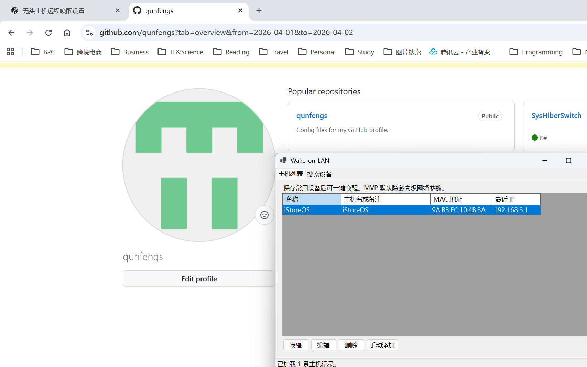

# WakeOnLan

一个基于 C#、WinForms 和 .NET 8 的局域网 Wake-on-LAN 桌面工具。

## 项目简介

本工具面向 Windows 桌面环境，提供一个轻量、直接、适合内部使用的 Wake-on-LAN 管理界面。

当前 MVP 已实现：

- 扫描当前 IPv4 子网中的在线设备
- 读取设备主机名、IP 地址、MAC 地址
- 将扫描结果加入主机列表
- 手动新增、编辑、删除主机记录
- 对已保存主机发送 Wake-on-LAN 唤醒包
- 使用本地 JSON 文件持久化主机数据
- 默认隐藏高级网络参数

## 技术栈

- C#
- WinForms
- .NET 8
- 本地 JSON 持久化

## 界面结构

应用包含两个页签。

### 主机列表

用于维护常用设备，并直接执行唤醒操作。

主要功能：

- 唤醒
- 编辑
- 删除
- 手动添加

### 搜索设备

用于扫描当前局域网中的在线设备，并将目标设备加入主机列表。

主要功能：

- 开始扫描
- 查看主机名、IP 地址、MAC 地址
- 将选中设备加入主机列表

## 界面预览



## 运行要求

- Windows
- 已安装 .NET 8 SDK 或 .NET 8 Desktop Runtime
- 目标设备已正确启用 Wake-on-LAN
- 目标设备与当前电脑位于同一局域网

## 构建方式

在项目根目录执行：

```powershell
dotnet build
```

调试输出默认位于：

```text
bin\Debug\net8.0-windows\
```

可执行文件为：

```text
bin\Debug\net8.0-windows\WakeOnLan.exe
```

## 数据存储

主机列表会保存到当前用户本地目录：

```text
%LocalAppData%\WakeOnLan\hosts.json
```

JSON 数据模型包含以下字段：

- `Id`
- `Name`
- `HostName`
- `MacAddress`
- `LastKnownIp`
- `Remark`
- `LastSeenAt`
- `LastWakeAt`

## 扫描说明

- 扫描仅用于发现当前在线设备
- 睡眠中的设备通常无法通过扫描发现
- 主机名会在显示时自动去掉末尾的 `.lan` 后缀
- 扫描仅支持当前活动 IPv4 网卡所在子网

## 仓库结构

```text
Forms/       WinForms 界面
Models/      数据模型
Services/    网络扫描、WOL、JSON 存储服务
docs/        项目截图等文档资源
Program.cs   程序入口
```

## 当前范围

当前版本为 MVP，不包含以下能力：

- 跨网段扫描
- 多网卡手动选择
- 自定义 UDP 端口
- 自定义广播地址
- 批量唤醒
- 托盘模式

## 方案文件

实现依据保留在：

```text
IMPLEMENTATION_PLAN.md
```

## License

本项目采用 MIT License，详见 [LICENSE](LICENSE)。
